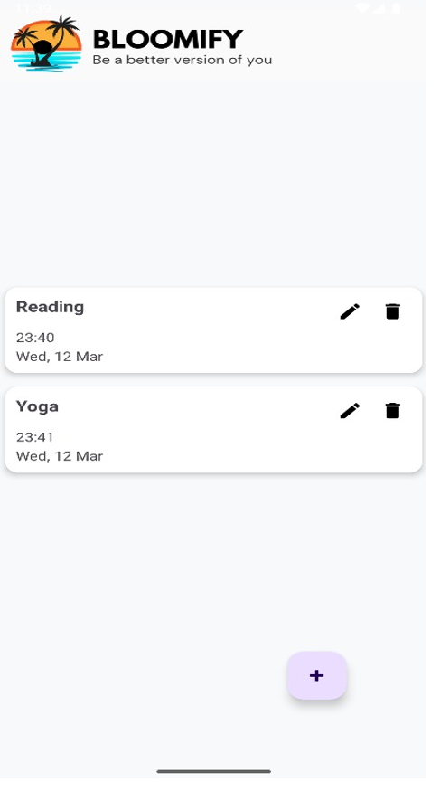
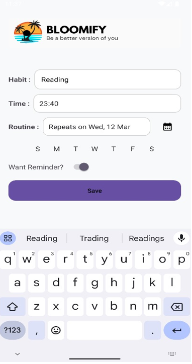
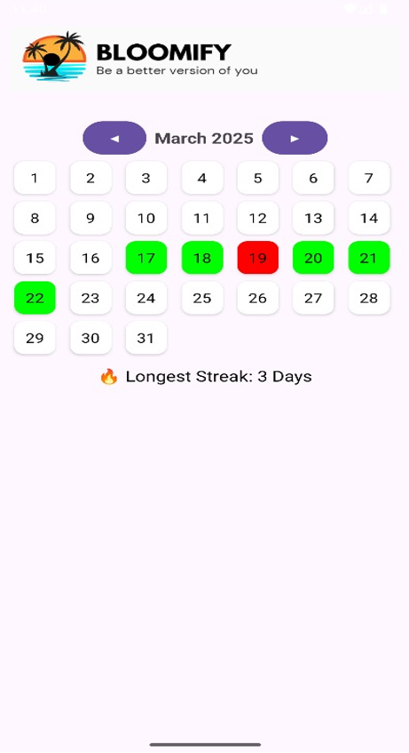
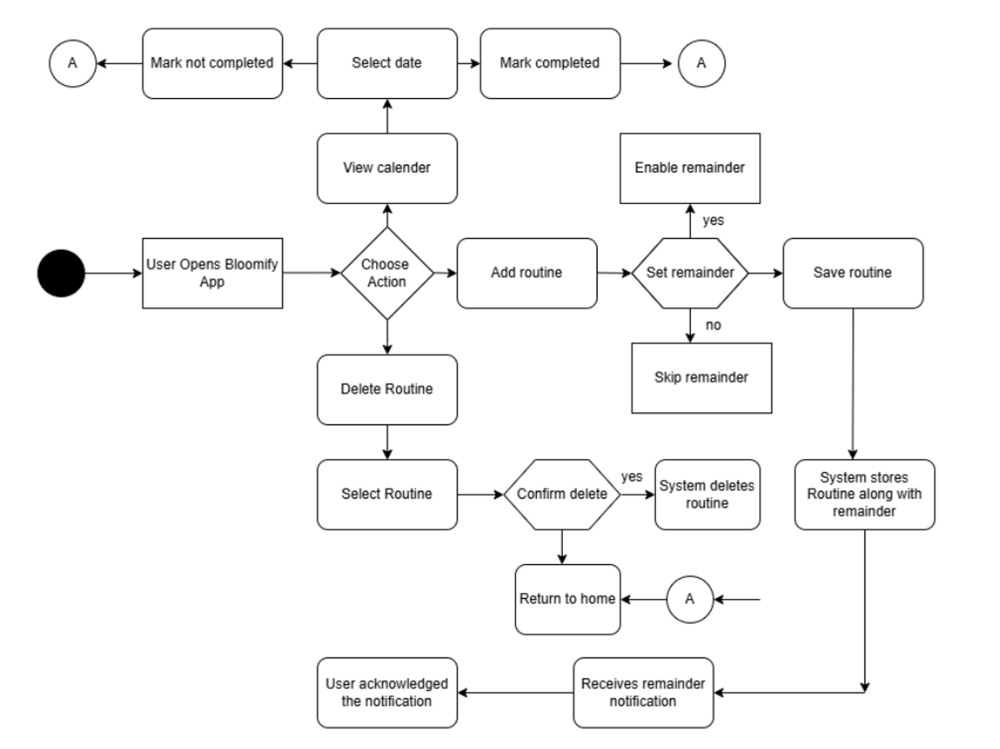

# Bloomify 🌱

*Be a better version of you !!*


Bloomify is a native Android application designed to help users build and maintain productive habits through an intuitive and motivating interface. Developed using Java in Android Studio, this app serves as a personal companion for anyone looking to stay consistent with their personal goals.

## ✨ Features

* **📝 Create & Manage Routines**: Easily add, edit, or delete habits with specific times and dates.
* **🗓️ Interactive Calendar**: Track your progress on a color-coded calendar. Mark days as **completed (green)** or **missed (red)**.
* **🔥 Streak Tracking**: Stay motivated by viewing your longest streak for each habit.
* **🔔 Smart Reminders**: Set optional reminders to get timely notifications for your scheduled routines.
* **💾 Local Storage**: All your data is stored securely on your device using an SQLite database, so it's always available.
* **👆 Gesture Controls**: Tap a date to mark a habit as complete, or double-tap to mark it as missed.


## 📸 Screenshots

| Splash Screen | Home Screen | Add Routine | Calendar View |
| :-----------: | :---------: | :---------: | :-----------: |
|  |  |  |  |


## 🛠️ Tech Stack

* **Language**: **Java**
* **IDE**: **Android Studio**
* **Database**: **SQLite** for local data persistence
* **UI**: **XML** for designing responsive layouts
* **SDK**: Android SDK

## 🏗️ Architecture

The application follows a structured approach with distinct components for managing UI, data, and background services.
 
## 🚀 Getting Started

To get a local copy up and running, follow these simple steps.

### Prerequisites

* Android Studio
* An Android device or emulator

### Installation

1.  Clone the repo
    ```sh
    git clone [https://github.com/your_username/Bloomify.git]
    ```
2.  Open the project in Android Studio.
3.  Let Gradle sync and build the project.
4.  Run the app on an emulator or a physical device.

